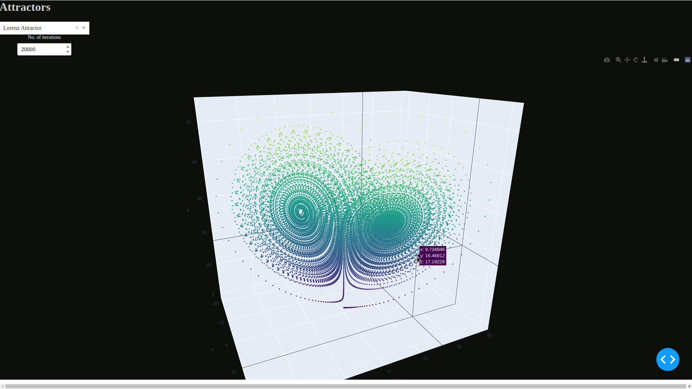
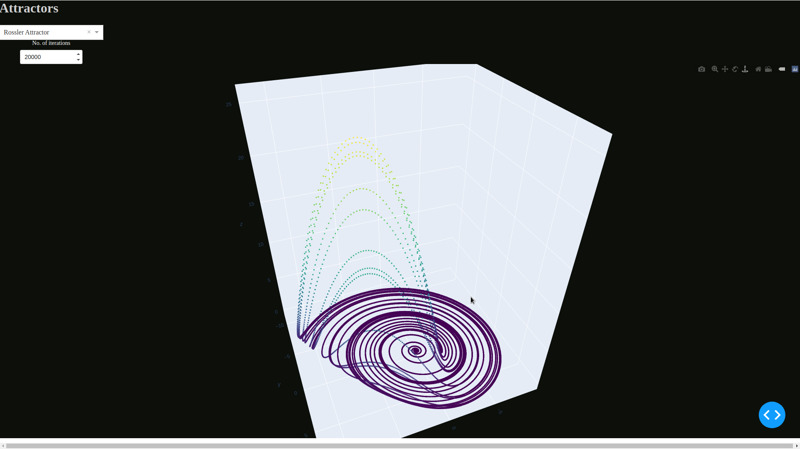
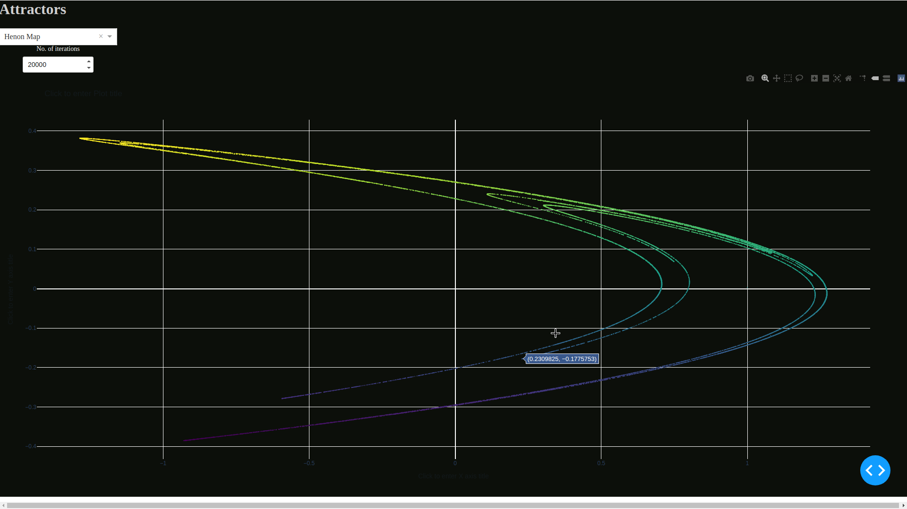
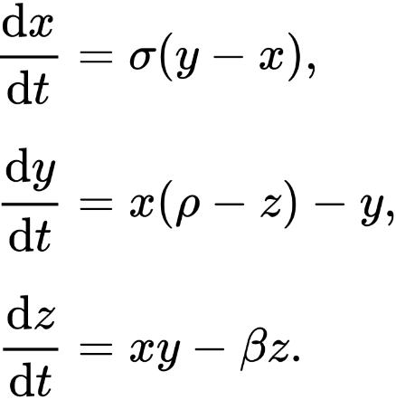
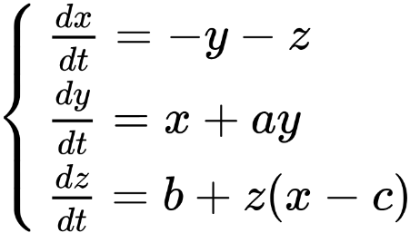
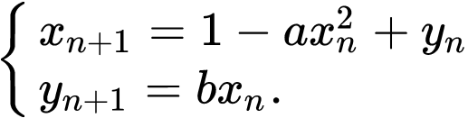

# Attractor Graphs
Live scatter plots of attractors using Dash.

* Plot examples:




* [Lorenz Attractor](https://en.wikipedia.org/wiki/Lorenz_system/) equations:


* [Rossler Attractor](https://en.wikipedia.org/wiki/R%C3%B6ssler_attractor) equations:


* [Henon Map](https://en.wikipedia.org/wiki/H%C3%A9non_map) equations:


## Getting Started
```
pip install -r requirements.txt
```

## Deployment
Use 'dash_main.py' to run the dashboard on the local server:
```
python3 main_dash.py
```

## Built With

* [Dash](https://plotly.com/dash/) - app framework


